# Leet Chess

>
> Sharpen your chess skills

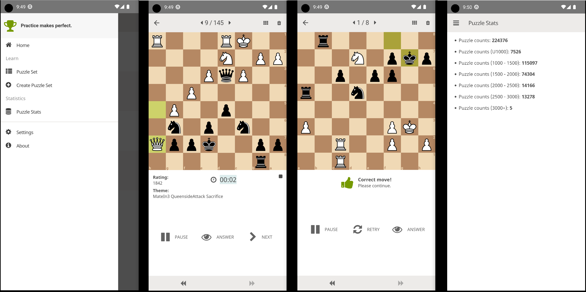

## Available on

   

## Feature

Leet Chess has a large set (about 220K) of the most popular open-source puzzles for you to work on at your fingertips. Here are some of the main features:

### Puzzles creation based on a search

Users can search for puzzles based on ratings, openings, tactical themes, pieces, and more.

- Puzzle set list view

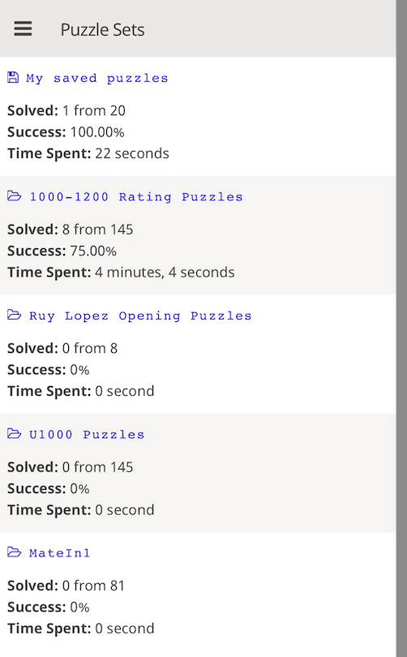

- Create puzzle set

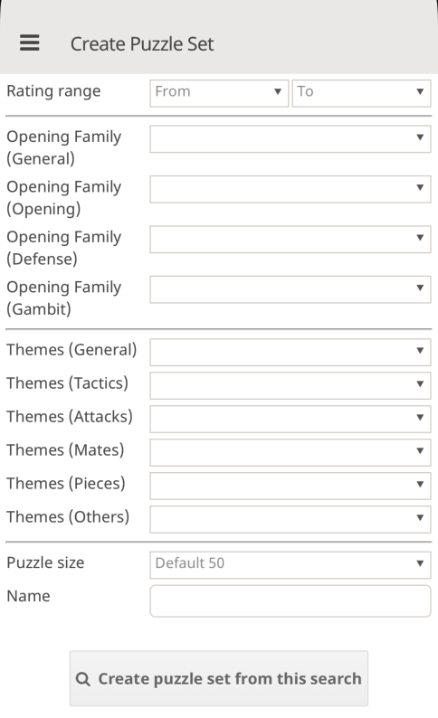

- Puzzle main interface

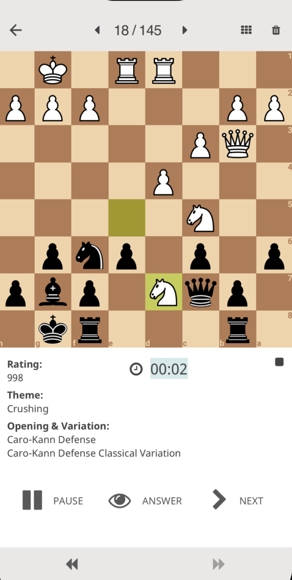

- Puzzle main interface puzzle continued

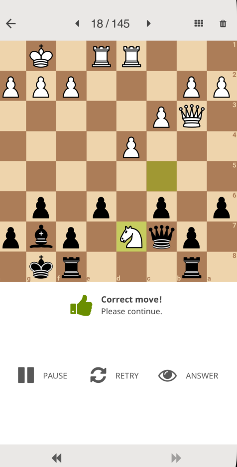

- Puzzle main interface puzzle solved

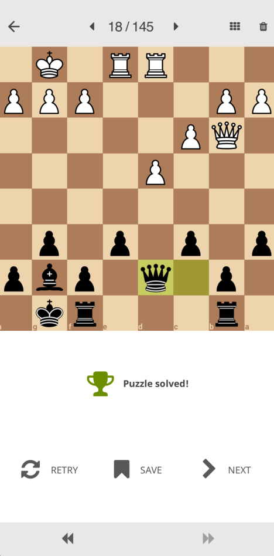

- Puzzle main adding puzzle to my saved puzzle list

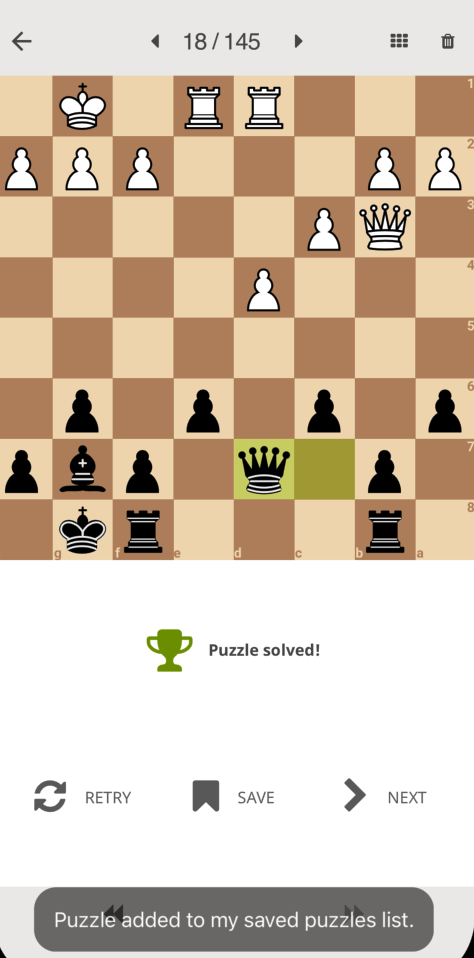

### Tracking puzzle progress/accuracy

Users can track their progress/accuracy in solving puzzles, and the app records which puzzles they have solved and which they are still working on.

- Puzzle set tracking on progress, accuracy and time spent

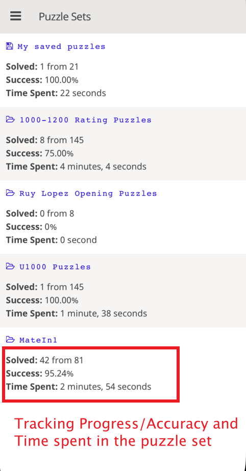

- Puzzle set birdview

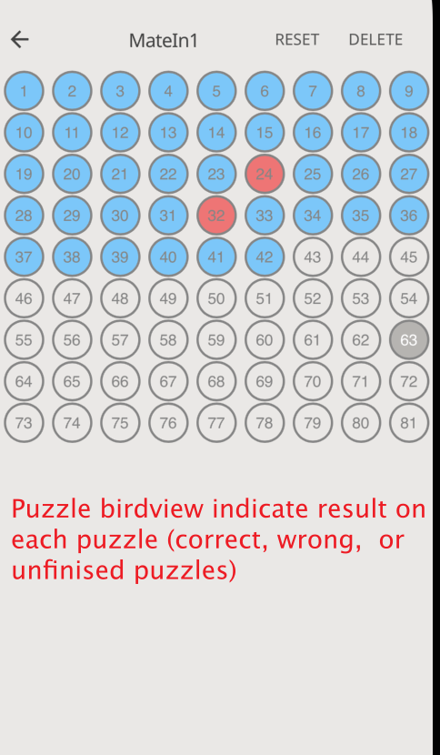

### Reset result

The app allows users to reset their results for specific puzzles. This means that if a user solves a puzzle but wants to try again to improve their time or score, they can reset the puzzle's results and try again. This feature is especially useful for users who want to challenge themselves and improve their tactical skills.

- Puzzle set progress `RESET` or `DELETE`

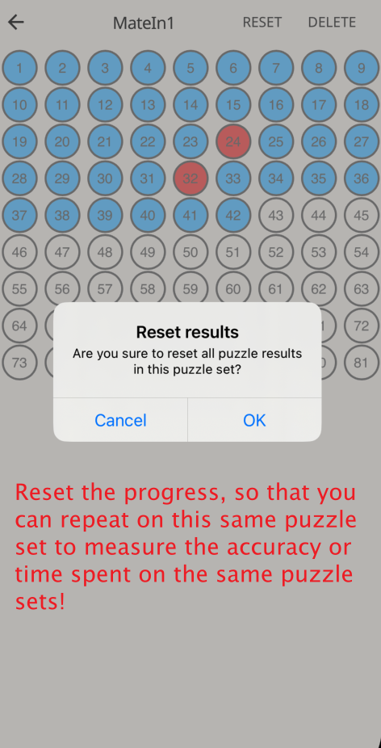

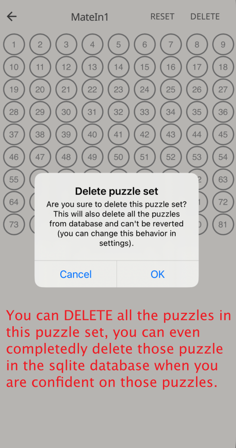

- Puzzle set progress `RESET` or `DELETE`

### Puzzle status and settings

- Total number of puzzles and ratings

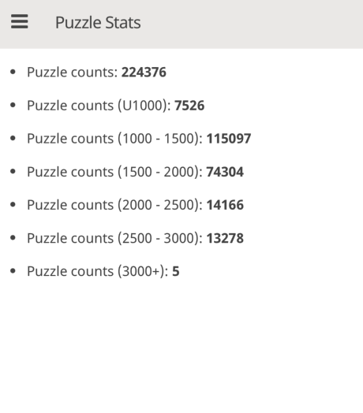

- Puzzle settings

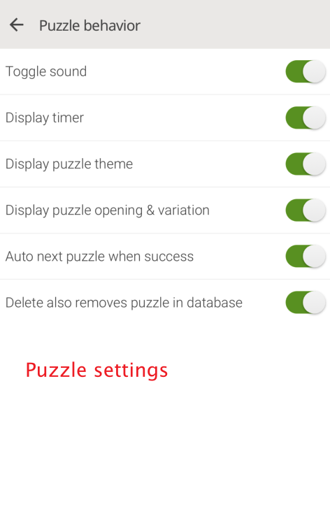

## Questions and issues

- Email: `leetchessapp@gmail.com`
- Submit issues at leetchess [GitHub Issues Page](https://github.com/leetchessapp/leetchessapp.github.io/issues)

